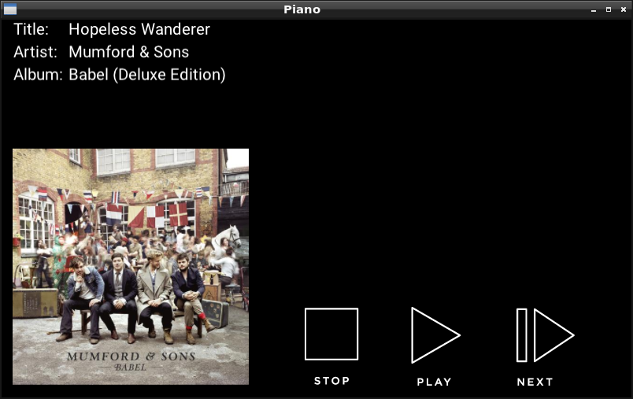

# PianoEx

A simple Pandora player visualizer and controller.



Rough diagram
```
pianobar -> command.sh -> PianoCtl.PianoInputReader
                    beam_notify     |
                                    v
                               PianoCtl.Server -> PianoUi
```

To test:

    ./test-example.sh

In IEx run `PianoCtl.Notifier.create_script` to create the command.sh script

## TODO

- [ ] Clean up the parsing code (rather hacky right now)
- [ ] Gracefully handle when the image cannot be downloaded (should have a placeholder)
- [x] Cover art should be resized to fit
- [ ] Extract text into a separate scene
- [x] Find a good name for the Splash scene

Done:
- [x] Change PianoParser to be able to accurately detect events
- [x] Display the current song in the scenic scene
- [x] Nodes should be configured from config
- [x] Fetch and display cover art
- [x] write the OS pid to `~/.config/pianobar/piano_ctl_pid`
- [x] command.sh should check the pid, and only write to the pipe if the process is still running
- [x] Add play/pause and next buttons
- [x] PianoCtl.CommandRunner is broken
- [x] Tap on cover art to hide

## EventCmd format

```
event_name   # The event name
             # An empty line
attr1=val1   # A list of attrs
attr2=val2
attr2=val2
attr2=val2
             # Another empty line
```

Examples:

songstart

<song starting details>

// time passes
songfinish
<song finished details>

stationfetchplaylist
<fetched song>

songstart
<song starting details>
